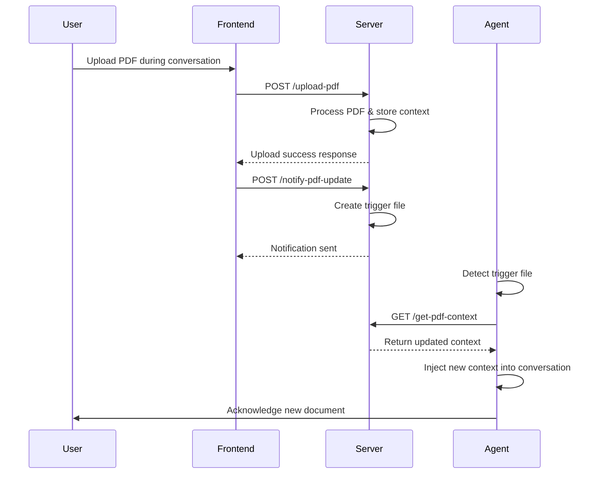

# Mid-Conversation PDF Upload Feature Guide

## 🎯 Overview

The LEVRA voice assistant now supports uploading PDF documents **during active conversations**, allowing users to add context dynamically without restarting their session.

## ✨ Features

### 1. **Pre-Conversation PDF Upload**

- Upload PDFs before starting the conversation
- AI reads and acknowledges the document content immediately
- Document context is integrated into the initial conversation

### 2. **Mid-Conversation PDF Upload** (NEW!)

- Upload additional PDFs during ongoing conversations
- AI automatically detects new uploads and acknowledges them
- Seamless context integration without interrupting the conversation flow
- Toggle uploader visibility during conversations

## 🚀 How to Use

### Starting a Conversation with PDF Context

1. **Open LEVRA Voice Assistant**
2. **Upload PDF** (optional):
   - Drag and drop your PDF file onto the upload area
   - Or click "Choose File" to select your document
   - Wait for the green "PDF context loaded" indicator
3. **Start Talking**: Begin your conversation - the AI will reference your document

### Adding PDFs During Conversation

1. **During an Active Conversation**:

   - Look for the "📄 Add PDF context to enhance this conversation" button
   - Or click "Add more PDFs" if you already have context loaded

2. **Upload Additional Documents**:

   - Click the upload button to show the PDF uploader
   - Upload your new document
   - The AI will automatically acknowledge the new content

3. **AI Response**:
   - AI immediately reads the new document
   - Provides acknowledgment of the new context
   - Incorporates the information into ongoing conversation

## 🔧 Technical Implementation

### Frontend Components

#### SimpleVoiceAssistant.jsx

- **State Management**:

  - `hasPdfContext`: Tracks if PDF context is available
  - `showMidConversationUploader`: Controls uploader visibility during conversations
  - `showPdfUploader`: Controls initial uploader visibility

- **Key Functions**:
  - `handlePdfUploadSuccess()`: Handles successful uploads and triggers AI notification
  - `notifyPdfUpdate()`: Sends notification to backend about new uploads
  - `toggleMidConversationUploader()`: Shows/hides uploader during conversations

#### User Interface Elements

1. **Pre-conversation uploader**: Shows before any messages
2. **PDF context indicator**: Shows when documents are loaded
3. **Mid-conversation button**: Allows adding PDFs during conversation
4. **System messages**: Confirm when new PDFs are processed

### Backend Implementation

#### server.py

- **`/upload-pdf`**: Processes PDF uploads and stores context
- **`/get-pdf-context/<room_id>`**: Retrieves stored PDF context
- **`/notify-pdf-update/<room_id>`**: Triggers mid-conversation context updates

#### agent.py

- **`refresh_pdf_context()`**: Refreshes context during active sessions
- **`monitor_pdf_updates()`**: Background monitoring for new uploads
- **File-based trigger system**: Uses trigger files to signal context updates

### Context Integration Flow



## 📋 Usage Examples

### Example 1: Adding Project Documentation

```
User: "I need help with project management"
AI: "I'd be happy to help with project management..."

[User uploads project plan PDF mid-conversation]

AI: "I've just received and read through your project plan! I can see you have a deadline of June 15th and a team of 5 members. Based on this context, let me provide specific guidance for your project..."
```

### Example 2: Multiple Document Upload

```
User: "Can you help me prepare for a meeting?"
AI: "Certainly! What kind of meeting preparation do you need?"

[User uploads meeting agenda PDF]

AI: "I've read your meeting agenda. I see it's focused on quarterly reviews..."

[Later, user uploads additional company policy PDF]

AI: "I've just received your company policy document as well. Now I have both your meeting agenda and company policies to reference. Let me help you prepare with this complete context..."
```

## 🎨 UI/UX Features

### Visual Indicators

- **Green indicator**: "📄 PDF context loaded"
- **Blue button**: "📄 Add PDF context to enhance this conversation"
- **System messages**: Automatic notifications when PDFs are processed
- **Toggle buttons**: "Hide uploader" / "Add more PDFs"

### Responsive Design

- Uploader appears/disappears smoothly
- Maintains conversation flow
- Clear visual feedback for all actions
- Accessible button styling with hover effects

## 🧪 Testing

### Run Test Suite

```bash
cd backend
python test_mid_conversation_upload.py
```

### Manual Testing Steps

1. Start the Flask server: `python server.py`
2. Start the frontend: `npm run dev`
3. Begin a conversation without uploading any PDF
4. During conversation, click "Add PDF context"
5. Upload a document
6. Verify AI acknowledges and references the new content

## 🔧 Configuration

### Server Configuration

- **Port**: 5001 (configurable in server.py)
- **CORS**: Enabled for all origins
- **File storage**: In-memory (upgrade to database for production)

### Frontend Configuration

- **Upload endpoint**: `http://localhost:5001/upload-pdf`
- **Notification endpoint**: `http://localhost:5001/notify-pdf-update`
- **Context retrieval**: `http://localhost:5001/get-pdf-context`

## 🚨 Troubleshooting

### Common Issues

#### PDF Not Acknowledged by AI

1. Check browser console for upload errors
2. Verify server is running on port 5001
3. Ensure PDF file is valid and readable
4. Check server logs for processing errors

#### Mid-Conversation Upload Button Not Appearing

1. Verify conversation has started (messages.length > 0)
2. Check if hasPdfContext state is properly managed
3. Ensure toggleMidConversationUploader function is working

#### Trigger File System Issues

1. Check file permissions in backend directory
2. Verify trigger files are being created and removed
3. Monitor agent.py logs for PDF update detection

### Debug Commands

```bash
# Check server logs
cd backend && python server.py

# Test PDF upload directly
curl -X POST -F "pdf_file=@test.pdf" -F "room_id=test123" http://localhost:5001/upload-pdf

# Test notification endpoint
curl -X POST http://localhost:5001/notify-pdf-update/test123
```

## 🛠️ Development Notes

### Future Enhancements

- **WebSocket Integration**: Replace file-based triggers with real-time WebSocket communication
- **Multiple PDF Management**: UI for managing multiple uploaded documents
- **PDF Preview**: Show document previews in the interface
- **Context History**: Track and display document upload history
- **Advanced Processing**: Support for images, tables, and complex document structures

### Performance Considerations

- **File Size Limits**: Currently supports PDFs up to reasonable size limits
- **Memory Usage**: In-memory storage should be replaced with database for production
- **Concurrent Sessions**: File-based triggers work for single-server deployments

## 📊 Success Metrics

The mid-conversation PDF upload feature provides:

- ✅ **Seamless Context Addition**: No need to restart conversations
- ✅ **Immediate AI Integration**: AI reads and acknowledges new documents instantly
- ✅ **Enhanced User Experience**: Flexible document management during conversations
- ✅ **Robust Error Handling**: Clear feedback and error recovery
- ✅ **Visual Feedback**: Clear indicators and system messages

This feature significantly enhances the LEVRA platform's flexibility and user experience by allowing dynamic context injection during active coaching sessions.
